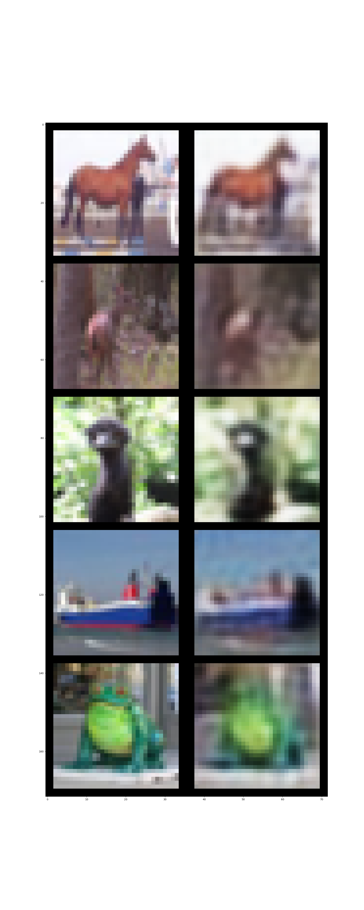
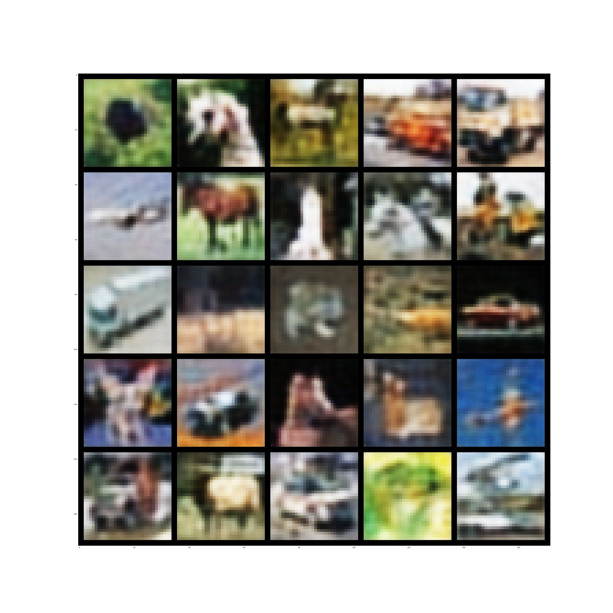

# DeepSMOTE
This repository provides a *unoffical* pytorch implementation of "DeepSMOTE: Fusing Deep Learning and SMOTE
for Imbalanced Data"

## Prerequsits
```bash
pip install -r requirements.txt
```

## demo of results
autoencoder reconstruction quality             |  sythetic images using smote
:-------------------------:|:-------------------------:
  |   