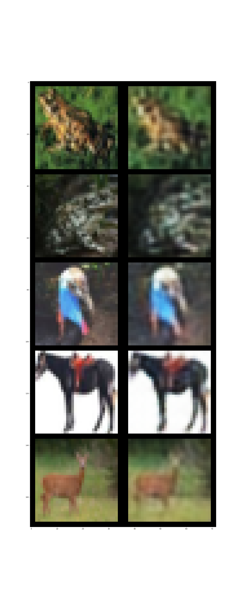
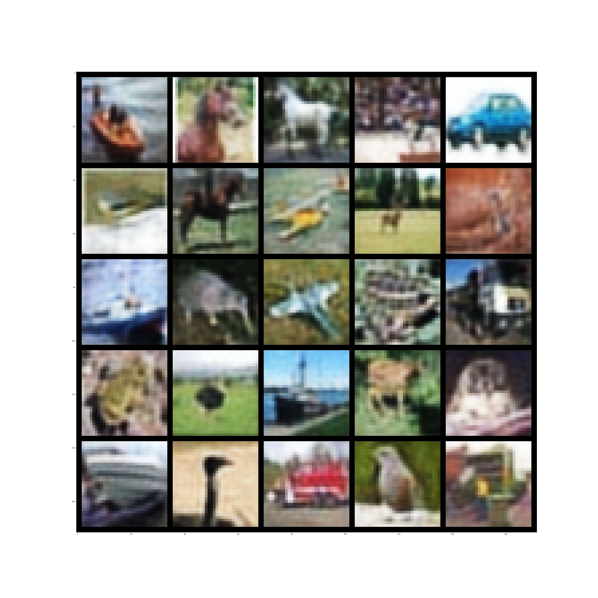
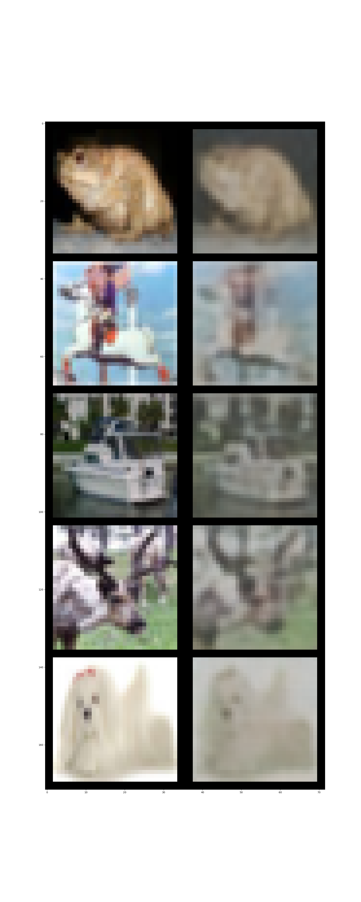
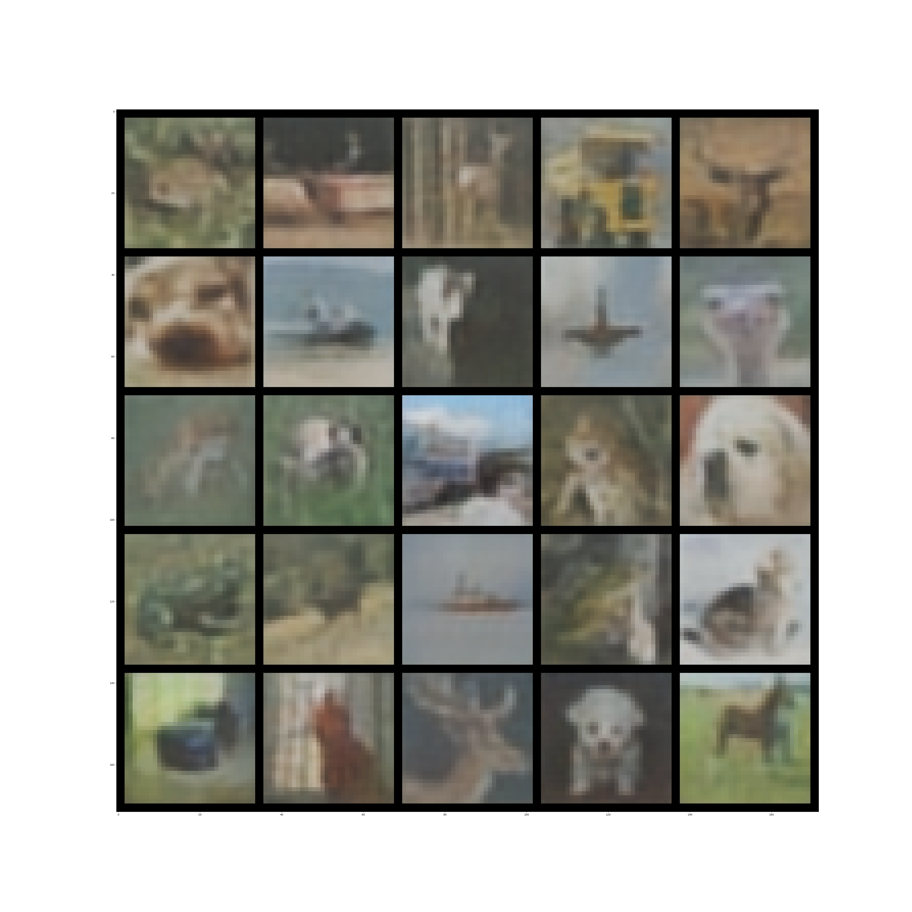

# DeepSMOTE
This repository provides a *unoffical* pytorch implementation of "DeepSMOTE: Fusing Deep Learning and SMOTE
for Imbalanced Data"

## Prerequsits
```bash
conda env create -f environment.yml
conda activate DeepSMOTE
```

## demo of results 
### naive autoencoder
***left:*** origional image ***right:*** reconstruction          |  sythetic images using smote
:-------------------------:|:-------------------------:
  |   

### autoencoder with random permutation
***left:*** origional image ***right:*** reconstruction          |  sythetic images using smote
:-------------------------:|:-------------------------:
  |   

## Run the code
```bash
## train model
python main.py --train

## test model (show reconstructions and sythetic images)
python main.py
```

## To Do
### dataset
- [x] [CIFAR10](https://www.cs.toronto.edu/~kriz/cifar.html)
- [ ] [HAM10000](https://dataverse.harvard.edu/dataset.xhtml?persistentId=doi:10.7910/DVN/DBW86T)
### network archicture
- [x] hand-craft CNN
- [ ] UNet

Please star this repo if you find it helpful
